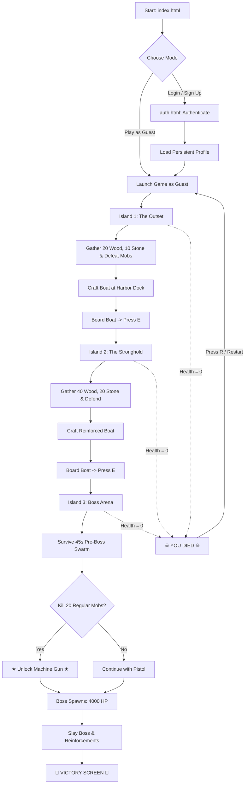

# 🏝️ IsleBound

[](LICENSE)
[](https://developer.mozilla.org/en-US/docs/Web/JavaScript)
[](https://developer.mozilla.org/en-US/docs/Web/API/Canvas_API)
[](https://developer.mozilla.org/en-US/docs/Web/API/IndexedDB_API)

> **IsleBound** is a 2D top-down pirate survival and exploration game built entirely with vanilla **HTML5**, **CSS3**, and **JavaScript (ES Modules)** leveraging the **HTML5 Canvas API**. Explore procedurally rendered tropical islands, gather raw resources, fend off aggressive pirate and skeleton mobs, craft escape vessels, unlock rapid-fire weaponry, and defeat the Island 3 pirate boss.

---

## 📑 Table of Contents

- [1. Overview](#1-overview)
- [2. Game Concept](#2-game-concept)
- [3. Key Features](#3-key-features)
- [4. Gameplay Loop](#4-gameplay-loop)
- [5. Islands & Progression](#5-islands--progression)
- [6. Combat System](#6-combat-system)
- [7. Weapons](#7-weapons)
- [8. Enemies & Boss Encounter](#8-enemies--boss-encounter)
- [9. Resources & Environment](#9-resources--environment)
- [10. Crafting System](#10-crafting-system)
- [11. Player Progression & Unlocks](#11-player-progression--unlocks)
- [12. Authentication & User Profiles](#12-authentication--user-profiles)
- [13. Statistics System](#13-statistics-system)
- [14. Controls](#14-controls)
- [15. UI & Screens](#15-ui--screens)
- [16. Technology Stack](#16-technology-stack)
- [17. Project Architecture](#17-project-architecture)
- [18. Project Structure](#18-project-structure)
- [19. How the Game Works (Runtime Engine)](#19-how-the-game-works-runtime-engine)
- [20. Data Storage & Persistence](#20-data-storage--persistence)
- [21. Getting Started & Installation](#21-getting-started--installation)
- [22. Running the Game Locally](#22-running-the-game-locally)
- [23. Game Flow Diagram](#23-game-flow-diagram)
- [24. Known Limitations](#24-known-limitations)
- [25. Future Improvements](#25-future-improvements)
- [26. Credits](#26-credits)
- [27. License](#27-license)

---

## 1. Overview

**IsleBound** is a client-side, browser-native survival action game. The player is stranded across an archipelago of hostile pirate islands. Survival requires navigating hazardous terrain, avoiding natural barriers, mining and harvesting essential materials, fighting relentless enemies, building escape boats, and surviving a final boss arena showdown.

The game is designed without heavy third-party frameworks, game engines (like Phaser, Unity, or Godot), or external build tools. It runs completely in modern web browsers using standard web APIs.

| Property | Details |
|---|---|
| **Title** | IsleBound |
| **Genre** | 2D Top-Down Survival / Action / Shooter |
| **Platform** | Modern Web Browsers (Chrome, Firefox, Safari, Edge) |
| **Rendering** | HTML5 2D Canvas Context (`CanvasRenderingContext2D`) |
| **Engine / Frameworks** | None (100% Vanilla JavaScript ES6+ Modules) |
| **World Dimensions** | 3840 × 2560 pixels (Tile Size: 64 × 64 px, 60 × 40 grid) |
| **Progression** | 3 Unique Islands with escalating difficulty and end-game boss |
| **Persistence** | IndexedDB (`IsleBoundDB`) + Session Storage |

---

## 2. Game Concept

The protagonist is stranded on the outer rim of an uncharted pirate archipelago. To escape and conquer IsleBound, the player must advance through three consecutive islands:

1. **Island 1 (The Outset):** Learn core survival mechanics, harvest starting resources (wood and stone), eliminate initial pirate scouting parties, craft a starter boat at the shoreline dock, and sail forward.
2. **Island 2 (The Stronghold):** Navigate an expanded capsule-shaped terrain with denser skeleton and pirate patrols, gather higher quantities of construction materials, and construct a reinforced vessel.
3. **Island 3 (The Pirate Lord's Domain):** Enter a resource-depleted arena. Face a 45-second pre-boss countdown with aggressive enemy swarms, eliminate 20 regular enemies to unlock the rapid-fire **Machine Gun**, survive continuous mob reinforcements, and defeat the 4,000 HP **Boss** to achieve final victory and escape.

---

## 3. Key Features

- **Custom 2D Canvas Engine:** Native rendering pipeline with sub-pixel rendering, sprite rotation based on mouse coordinates, dynamic camera tracking, and custom crosshair cursors.
- **Continuous World Camera:** Smooth camera bounding box tracking that follows the player across a 3840×2560 px map while clamping to viewport limits.
- **Mathematical Island Generation:** Island terrain maps generated dynamically using mathematical distance equations (elliptical distance for Islands 1 and 3, horizontal capsule equations for Island 2).
- **Multi-State Enemy AI:** State machines supporting `idle`, `chase`, and `attack` states with dynamic range detection, pursuit path calculation, lunge attack animations, cooldown management, and hit flinch/knockback.
- **Two-Tier Weapon Arsenal:** Standard Semi-Automatic Pistol transitioning to a high-rate-of-fire Machine Gun upon scoring 20 kills on Island 3.
- **Dynamic Resource Gathering & Respawning:** Discrete collectible wood piles and stone clusters that yield random amounts (1–4 units), replenish on 10-second timers, and validate distance constraints from obstacles.
- **Harbor Boat Construction:** On-demand crafting system tied to specific island recipes. Crafting manifests an interactive boat at the harbor coordinates (`x: 3590, y: 1280`), transitioning the player between world stages.
- **Endgame Boss Arena:** High-stakes final encounter on Island 3 featuring a 45-second arrival countdown, persistent reinforcement spawning every 4 seconds, overhead boss health bar, and victory transition.
- **Multi-Tier Account & Profile System:**
  - **Guest Mode:** Immediate gameplay without login; session stats tracked in memory.
  - **Registered Accounts:** Full user registration, login, and session persistence stored locally via **IndexedDB**.
  - **Lifetime Statistics Tracking:** 13 persistent statistical metrics tracked across all runs.
- **Responsive Screen Management:** Seamless transitions between Main Menu, In-game HUD, Crafting Menu, Pause Overlay, Death Screen, Victory Screen, Authentication, and Player Profile.

---

## 4. Gameplay Loop

```
[ Main Menu / Profile ]
        │
        ▼
   [ Island 1 ] ──► Gather Wood & Stone ──► Defend against Pirates/Skeletons ──► Craft Boat ──► Sail
        │
        ▼
   [ Island 2 ] ──► Gather Higher Resources ──► Defeat Expanded Patrols ──► Craft Reinforced Boat ──► Sail
        │
        ▼
   [ Island 3 ] ──► 45s Countdown Swarm ──► Kill 20 Mobs (Unlock Machine Gun) ──► Defeat Boss ──► VICTORY!
```

---

## 5. Islands & Progression

The game features **3 sequential islands**. Progress is tracked by `islandManager.js` and rendered via `world.js`. Moving between islands transfers current inventory and cumulative statistics while resetting the local map state, active enemies, and boat construction.

```
World Size: 3840px (60 columns) × 2560px (40 rows) | Tile Size: 64 × 64 pixels
```

| Property | Island 1 | Island 2 | Island 3 (Final Stage) |
|---|---|---|---|
| **Shape** | Elliptical ($r_x = 28, r_y = 18$) | Horizontal Capsule ($r_y = 18, \text{length} = 10$) | Elliptical Arena ($r_x = 28, r_y = 18$) |
| **Role** | Starter exploration | Resource gathering & combat | Boss survival arena |
| **Initial Pirates** | 6 | 10 | 10 (aggro range boosted 1.8×) |
| **Initial Skeletons** | 4 | 7 | 10 (aggro range boosted 1.8×) |
| **Boss Count** | 0 | 0 | 1 (spawns at $T = 45\text{s}$) |
| **Reinforcements** | None | None | 1 enemy every 4s (max 4 alive) |
| **Wood Spawns** | 15 piles | 25 piles | 0 (combat only) |
| **Stone Spawns** | 10 piles | 15 piles | 0 (combat only) |
| **Boat Craft Cost** | 20 Wood, 10 Stone | 40 Wood, 20 Stone | N/A (Defeat Boss to Escape) |
| **Objective** | Build boat & escape | Build boat & escape | Slay Boss & conquer IsleBound |

---

## 6. Combat System

Combat in IsleBound uses real-time vector trigonometry for trajectory calculations, hitbox collision detection, knockback impulse forces, and visual damage feedback.

- **Aiming:** The player calculates an angle $\theta = \text{atan2}(y_{\text{mouse}} - y_{\text{player}}, x_{\text{mouse}} - x_{\text{player}})$ relative to world coordinates.
- **Firing:** Holding or clicking the Left Mouse Button spawns projectile entities at player center coordinates.
- **Collision & Wall Penetration:** Bullets travel in straight vectors. If a bullet intersects a non-walkable tile (water, dense trees, or rocks), it is immediately destroyed.
- **Damage & Knockback:** Upon hitting an enemy:
  - Bullet damage is subtracted from the enemy's current HP.
  - Enemy hit flash is triggered (`hitFlash = 0.12s`, rendering semi-transparent).
  - Knockback impulse is applied along the impact vector ($\Delta x, \Delta y = -120 \cdot \cos\theta, -120 \cdot \sin\theta$) and dampened each frame.
- **Player Damage & Invulnerability:**
  - When an enemy successfully strikes the player, player health drops according to enemy attack power.
  - A red vignette overlay flashes on screen (`playerHitFlash = 0.18s`).
  - Player receives knockback force ($260\text{ px/s}$) away from non-boss attackers.
  - Player is granted a brief invulnerability window (`invulnTimer = 0.55s`) preventing immediate death from grouped mobs.

---

## 7. Weapons

The player starts with a standard sidearm and can unlock an upgraded rapid-fire weapon on the final island:

| Weapon | Unlock Condition | Fire Rate / Delay | Damage per Bullet | Bullet Speed | Projectile Size | Sprite Reference |
|---|---|---|---|---|---|---|
| **Pistol** | Available by default (Islands 1–3) | 0.20s (5 rounds/sec) | 15 HP | 700 px/sec | 8 × 8 px | `manBlue_gun.png` |
| **Machine Gun** | 20 regular kills on Island 3 | 0.08s (12.5 rounds/sec) | 25 HP | 700 px/sec | 8 × 8 px | `manBlue_machine.png` |

When the Machine Gun is unlocked on Island 3:
1. `player.weapon` switches to `"machineGun"`.
2. `player.shootDelay` drops from `0.20s` to `0.08s`.
3. An on-screen gold celebration banner appears: `★ MACHINE GUN UNLOCKED! ★`.
4. HUD weapon indicator updates to `WEAPON: MACHINE GUN`.

---

## 8. Enemies & Boss Encounter

### Regular Enemies

All enemy behaviors, parameters, and sprites are defined in `enemies.js`:

| Enemy Type | Sprite Asset | Max HP | Speed | Detection Range | Attack Range | Cooldown | Damage | Collision Radius |
|---|---|:---:|:---:|:---:|:---:|:---:|:---:|:---:|
| 🏴‍☠️ **Pirate** | `pirate.png` | 40 | 95 px/s | 500 px *(900 on Island 3)* | 55 px | 1.1s | 12 HP | 15 px |
| 💀 **Skeleton** | `skeleton.png` | 60 | 125 px/s | 550 px *(990 on Island 3)* | 50 px | 0.8s | 18 HP | 16 px |
| 👑 **Boss** | `boss.png` | 4,000 | 380 px/s | 800 px | 80 px | 1.0s | 20 HP | 300 px |

### AI State Machine

```
   ┌─────────┐   Player within Detection Range    ┌──────────┐
   │  IDLE   │ ─────────────────────────────────► │  CHASE   │
   └─────────┘ ◄───────────────────────────────── └──────────┘
                  Player leaves Detection Range         │
                                                        │ Player within Attack Range
                                                        ▼
                                                  ┌──────────┐
                                                  │  ATTACK  │ (Lunge 18px, scale 1.15×)
                                                  └──────────┘
```

1. **Idle:** The entity stands in place when the player is outside its detection radius.
2. **Chase:** The entity rotates toward the player and calculates linear velocity ($v_x = \cos\theta \cdot \text{speed}, v_y = \sin\theta \cdot \text{speed}$), avoiding water and obstacles via `isWalkable()`.
3. **Attack:** When within attack range and `cdTimer <= 0`:
   - Enters `attack` state for `0.25s` (`ATTACK_DURATION`).
   - Lunges forward 18 pixels while scaling up by 1.15×.
   - Applies damage at the midpoint ($T = 0.125\text{s}$) of the lunge animation.
   - Resets state to `chase` and puts attack on cooldown.

### Island 3 Boss Encounter Mechanics

- **Arrival Timer:** Island 3 features a pre-boss survival timer of **45.0 seconds**.
- **Boss Spawn:** At $T = 0$, the Boss spawns at world center (`x: 1895, y: 1255`).
- **Boss Stats:** 4,000 HP, high mobility (380 px/s), 20 damage per hit, and a 160×8 px overhead health bar rendered on canvas.
- **Minion Reinforcements:** While the Boss is alive, reinforcement mobs spawn every 4.0 seconds (capped at a maximum of 4 active reinforcements at once).
- **Victory Transition:** Upon the Boss's HP reaching 0, a 2.0-second victory countdown completes, triggering the global Victory Screen.

---

## 9. Resources & Environment

### Terrain Structure (`terrain.js` & `world.js`)

The world consists of a 60 × 40 grid of 64 × 64 px tiles:
- **`W` (Water):** Surrounds the perimeter. Impassable for bullets, player, and enemies.
- **`S` (Sand):** Shoreline transition zone. Walkable.
- **`G` (Grass):** Island interior. Walkable. Resources and obstacles generate exclusively on grass tiles.

### Collectible Resources (`resources.js`)

Resources are distinct collectible entities with interaction radiuses:

| Resource | Visual Representation | Yield per Node | Respawn Timer | Island 1 Count | Island 2 Count | Island 3 Count |
|---|---|---|---|---|---|---|
| **Wood** | Brown log with circular endcap | 1 to 4 units | 10.0 seconds | 15 nodes | 25 nodes | 0 nodes |
| **Stone** | Gray stone node with outline | 1 to 4 units | 10.0 seconds | 10 nodes | 15 nodes | 0 nodes |

- **Gathering Mechanism:** Walk within **60 pixels** of a node and press <kbd>E</kbd>.
- **Spawning Validation:** Placement algorithms verify that resource nodes spawn exclusively on grass tiles, maintain a 300 px buffer from other resource nodes, and maintain a 45 px buffer from environmental obstacles.

### Environmental Obstacles (`obstacles.js`)

Obstacles are static world props that obstruct player movement, enemy navigation, and bullet trajectories:

- **Palm Trees (`palm_detailed_long.png`):** Rendered at 100 × 150 px with a focused trunk collision box of 30 × 35 px at the base. Spawns 12 trees.
- **Formation Rocks (`formation_rock.png`):** Rendered at 75–95 × 55–70 px with a 70% proportional collision box. Spawns 8 rocks.

---

## 10. Crafting System

The crafting system (`crafting.js`) controls the progression requirements needed to escape Islands 1 and 2:

```
[ Gather Wood & Stone ] ──► Open Crafting Menu (C) ──► Click "Craft Boat" (or press B) ──► Boat appears at Shoreline Dock
```

### Boat Recipes

| Island | Wood Required | Stone Required | Result |
|:---:|:---:|:---:|---|
| **Island 1** | 20 Wood | 10 Stone | Crafts Escape Boat (Single use per island) |
| **Island 2** | 40 Wood | 20 Stone | Crafts Reinforced Escape Boat |
| **Island 3** | N/A | N/A | No crafting available (Combat arena) |

### Crafting Rules & Behavior
- Only **one boat** can be crafted per island.
- Inventory resources carried over from previous islands count toward the next island's recipe.
- Before crafting, the boat location at shoreline coordinates (`x: 3590, y: 1280`) displays a dashed blueprint outline.
- Once crafted, the full wooden boat sprite renders at the harbor dock.
- Approaching the boat within 100 px and pressing <kbd>E</kbd> completes the island and opens the transition banner.

---

## 11. Player Progression & Unlocks

Player progression spans both per-run equipment upgrades and multi-run account persistence:

1. **Persistent Inventory Across Islands:** Unused wood and stone remain in the player's inventory when sailing from Island 1 to Island 2.
2. **Machine Gun Unlock:** Eliminating 20 regular pirate/skeleton enemies on Island 3 unlocks the Machine Gun, replacing the pistol for the remainder of the run.
3. **Session & Lifetime Tracking:** Every shot, kill, resource gathered, death, and island completion is recorded dynamically into the active profile.

---

## 12. Authentication & User Profiles

IsleBound provides a complete authentication and user profile management system implemented with **IndexedDB** and **SessionStorage**:

### Modes of Play

- **Guest Mode:**
  - Active by default without logging in.
  - Profile displays a "GUEST MODE" banner.
  - Statistics are tracked in memory for the active browser session.
- **Registered User Account:**
  - Create an account with a unique username (3–20 characters) and password (min 4 characters).
  - Username cannot be `"guest"`.
  - Stored in IndexedDB (`IsleBoundDB` $\rightarrow$ `users` store).
  - Statistics persist across sessions in the `stats` object store.

### Security Transparency Note
> **Note:** As IsleBound is a client-side portfolio application, user credentials and statistics are stored locally in the browser's IndexedDB without server-side hashing or remote network transmission.

### Profile Navigation
- From Main Menu: Click **PLAYER PROFILE** to view `profile.html`.
- From Profile Page: Switch between Login and Sign Up or Log Out back into Guest Mode.

---

## 13. Statistics System

The statistics engine (`stats.js`, `db.js`, and `profile.js`) records 13 specific metrics during gameplay:

| Metric | Description | Event Trigger |
|---|---|---|
| **Player Name** | Display name of the active user | Login / Guest default |
| **Account Type** | Registered Profile vs Guest (Temporary) | Auth state |
| **Games Played** | Total game runs initiated | `recordGameStarted()` |
| **Current Island** | Furthest active island reached | `setCurrentIsland(n)` |
| **Islands Completed** | Number of completed island stages | `recordIslandCompleted()` |
| **Enemies Defeated** | Total enemies killed (all types) | `recordEnemyDefeated(type)` |
| **Pirates Defeated** | Total pirate mobs eliminated | `recordEnemyDefeated("pirate")` |
| **Skeletons Defeated** | Total skeleton mobs eliminated | `recordEnemyDefeated("skeleton")` |
| **Bosses Defeated** | Total Island 3 bosses eliminated | `recordEnemyDefeated("boss")` |
| **Shots Fired** | Projectiles fired from all weapons | `recordShotFired()` |
| **Damage Dealt** | Cumulative damage dealt to enemies | `recordDamageDealt(amount)` |
| **Wood Collected** | Total wood units gathered | `recordResourceCollected("wood", n)` |
| **Stone Collected** | Total stone units gathered | `recordResourceCollected("stone", n)` |
| **Deaths** | Total player deaths recorded | `recordDeath()` |
| **Total Play Time** | Cumulative time spent in gameplay (MM:SS) | `addPlayTime(dt)` |

---

## 14. Controls

IsleBound features dual-input keyboard and mouse controls:

| Action | Primary Key | Alternate Key | Description |
|---|---|---|---|
| **Move Up** | <kbd>W</kbd> | <kbd>↑</kbd> (Up Arrow) | Move player upward |
| **Move Down** | <kbd>S</kbd> | <kbd>↓</kbd> (Down Arrow) | Move player downward |
| **Move Left** | <kbd>A</kbd> | <kbd>←</kbd> (Left Arrow) | Move player leftward |
| **Move Right** | <kbd>D</kbd> | <kbd>→</kbd> (Right Arrow) | Move player rightward |
| **Aim** | **Mouse Position** | — | Rotate player aim angle toward cursor |
| **Shoot** | **Left Mouse Button** | — | Fire active weapon (Pistol or Machine Gun) |
| **Interact / Gather** | <kbd>E</kbd> | — | Gather nearby resource / Board crafted boat / Continue |
| **Toggle Crafting** | <kbd>C</kbd> | — | Open or close the in-game crafting overlay |
| **Craft Boat** | <kbd>B</kbd> | **UI Button** | Quick-craft boat while crafting overlay is open |
| **Pause / Resume** | <kbd>P</kbd> | — | Pause gameplay and open pause menu overlay |
| **Restart** | <kbd>R</kbd> | **UI Button** | Instantly restart game after death or victory |

---

## 15. UI & Screens

```
├── Main Menu (index.html)
│   ├── Top HUD (Active player display, Login / Signup / Logout buttons)
│   ├── Main Actions (Play Game, Player Profile, Controls, Credits)
│   ├── Controls Modal
│   └── Credits Modal
│
├── In-Game HUD (Canvas Layer)
│   ├── Health Bar (Top-left, 200px red bar)
│   ├── Inventory Box (Wood and Stone quantities)
│   ├── Weapon Indicator (WEAPON: PISTOL / MACHINE GUN)
│   ├── Interaction Prompt ("Press E to gather...", "Press E to use boat")
│   ├── Crafting Modal (Wood/Stone requirements, Craft button)
│   ├── Island 3 Boss Countdown & Fight Banner
│   ├── Island 3 Machine Gun Unlock Counter (Kills: X/20)
│   └── Red Hit Vignette Flash
│
├── Game State Overlays
│   ├── Pause Screen (Resume, Controls, Main Menu)
│   ├── Death Screen (YOU DIED, Restart, Main Menu)
│   ├── Island Completed Banner (Press E to continue)
│   └── Victory Screen (YOU WIN!, Stats summary, Main Menu)
│
├── Authentication View (auth.html)
│   ├── Login Card (Username, Password, Submit, Switch to Signup)
│   └── Sign Up Card (Username, Password, Confirm Password, Submit)
│
└── Player Profile View (profile.html)
    ├── User Badge & Guest Banner
    ├── 13-Metric Lifetime / Session Stats Grid
    └── Account Actions (Login, Signup, Logout, Back to Game)
```

---

## 16. Technology Stack

- **HTML5:** Semantic document structuring, multi-page routing (`index.html`, `auth.html`, `profile.html`), and HTML5 `<canvas>` elements.
- **CSS3:** Custom responsive layout design, dark nautical radial gradients (`radial-gradient`), backdrop blur filters (`backdrop-filter: blur(6px)`), CSS Grid for statistics display, and custom crosshair styling.
- **JavaScript (ES6+ Modules):** 100% vanilla modular scripts (`type="module"`), native `requestAnimationFrame` game loop, classless functional state machines, and mathematical vector calculations.
- **HTML5 Canvas 2D Context:** Sub-pixel sprite rendering, canvas rotation matrices (`translate`, `rotate`), dynamic clipping, tilemap rendering, and custom HUD text drawing.
- **IndexedDB API:** Client-side asynchronous NoSQL storage for persistent user account records and lifetime statistics.
- **Web Storage API (`sessionStorage`):** Temporary session management for active logged-in user tokens and seamless auto-restart flags.
- **Git & GitHub:** Version control, branch tracking, and open-source project hosting.

---

## 17. Project Architecture

IsleBound is engineered with an isolated, modular architecture where each file handles a single domain responsibility:

```
                      ┌────────────────────────┐
                      │        main.js         │
                      │  (UI Routing & Init)   │
                      └───────────┬────────────┘
                                  │
                                  ▼
                      ┌────────────────────────┐
                      │       gameLoop.js      │
                      │  (RAF & Delta Timing)  │
                      └───────────┬────────────┘
                                  │
                                  ▼
                      ┌────────────────────────┐
                      │        game.js         │
                      │  (Master Coordinator)  │
                      └─────┬────────────┬─────┘
                            │            │
         ┌──────────────────┴───┐    ┌───┴───────────────────┐
         ▼                      ▼    ▼                       ▼
  [ Core Systems ]       [ World/Render ]             [ Progression ]
  • player.js            • world.js                   • islandManager.js
  • movement.js          • terrain.js                 • islandComplete.js
  • collision.js         • obstacles.js               • boat.js
  • weapons.js           • camera.js                  • crafting.js
  • enemies.js           • canvas.js                  • inventory.js
  • input.js             • resources.js               • stats.js
                                                      • auth.js / db.js
```

### Module Responsibilities

| File | Primary Responsibility |
|---|---|
| **`main.js`** | DOM event listeners for main menu, pause, death, victory, and game boot |
| **`gameLoop.js`** | Delta-time calculation ($\Delta t = \min(\text{elapsed}, 0.05)$) and `requestAnimationFrame` loop |
| **`game.js`** | Central coordinator managing frame updates, input handling, and screen drawing |
| **`canvas.js`** | Canvas element initialization, 2D rendering context, and window resize listeners |
| **`input.js`** | Tracking keyboard states (`keys`), mouse coordinates, and click states (`mouse`) |
| **`camera.js`** | Viewport translation tracking centered on player with world boundary clamping |
| **`world.js`** | Global world bounds (3840×2560 px), tile dimensions, and mathematical terrain generation |
| **`terrain.js`** | Tilemap decoding, asset caching, and visible tile viewport rendering |
| **`player.js`** | Player object state, dimensions, speed, health, weapon assignment, and reset logic |
| **`movement.js`** | Translating keyboard input into velocity and executing walkability checks |
| **`collision.js`** | AABB rectangle overlap checks, obstacle collision, and terrain walkability verification |
| **`weapons.js`** | Projectile instantiation, movement updates, wall collision, and rendering |
| **`enemies.js`** | Enemy definitions, spawning algorithms, AI state updates, attack animations, and boss logic |
| **`obstacles.js`** | Spawning and drawing static environmental obstacles (trees and rocks) |
| **`resources.js`** | Generating collectible wood/stone nodes, collection interaction, and respawn timers |
| **`inventory.js`** | Managing current player inventory count for wood and stone |
| **`crafting.js`** | Validating recipes and deducting resources for boat construction |
| **`boat.js`** | Boat state, harbor docking coordinates, player proximity detection, and sprite rendering |
| **`islandManager.js`** | Island stage tracking (1 to 3), next island transitions, and final island detection |
| **`islandComplete.js`** | Island completion banner rendering, game victory triggers, and stats summary formatting |
| **`auth.js`** | Login, signup, logout routines, and active session management |
| **`authPage.js`** | Form validation and UI switching for `auth.html` |
| **`db.js`** | IndexedDB wrapper for opening database, creating object stores, and querying user stats |
| **`profile.js`** | Player profile page data binding, formatting, and DOM updates for `profile.html` |
| **`stats.js`** | In-game statistics accumulation and persistence syncing with IndexedDB |

---

## 18. Project Structure

```text
IsleBound/
├── index.html                  # Main application & game canvas entry point
├── auth.html                   # Authentication page (Login / Sign Up)
├── profile.html                # Player profile & lifetime statistics view
├── README.md                   # Complete project documentation
├── LICENSE                     # MIT Open-Source License
├── .gitignore                  # Git exclusion rules
│
├── css/
│   ├── style.css               # Main gameplay & menu styling
│   ├── auth.css                # Authentication forms & card styles
│   └── profile.css             # Player profile layout & stats grid styles
│
├── js/
│   ├── main.js                 # UI screen controller & startup logic
│   ├── game.js                 # Master game update & render coordinator
│   ├── gameLoop.js             # High-precision delta-time animation loop
│   ├── canvas.js               # Canvas sizing & 2D context provider
│   ├── input.js                # Keyboard & mouse event listener bindings
│   ├── camera.js               # Viewport camera following & bounding
│   ├── world.js                # World dimensions & terrain map generator
│   ├── terrain.js              # Tilemap renderer & terrain textures
│   ├── player.js               # Player entity properties & state resets
│   ├── movement.js             # Player motion & collision resolution
│   ├── collision.js            # AABB intersection & walkability logic
│   ├── weapons.js              # Projectile simulation & bullet rendering
│   ├── enemies.js              # Enemy AI, attack animations & boss logic
│   ├── obstacles.js            # Trees & rocks spawning and collisions
│   ├── resources.js            # Collectible wood/stone nodes & respawns
│   ├── inventory.js            # Inventory resource counters
│   ├── crafting.js             # Island boat recipes & crafting validation
│   ├── boat.js                 # Harbor escape boat logic & rendering
│   ├── islandManager.js        # Island index & progression management
│   ├── islandComplete.js       # Stage completion & victory screen triggers
│   ├── auth.js                 # Authentication logic & session tokens
│   ├── authPage.js             # Authentication form event handlers
│   ├── db.js                   # IndexedDB database operations
│   ├── profile.js              # Profile view renderer & stat formatters
│   └── stats.js                # Real-time gameplay statistics tracker
│
└── assets/
    ├── enemies/
    │   ├── pirate.png          # Pirate enemy sprite
    │   ├── skeleton.png        # Skeleton enemy sprite
    │   └── boss.png            # Island 3 final boss sprite
    ├── environment/
    │   ├── rocks/              # Environmental rock formations
    │   ├── terrain/            # Grass, sand, and dirt tiles
    │   ├── vegetation/         # Palm trees and tropical foliage
    │   └── water/              # Water tile textures
    ├── items/
    │   └── boat.png            # Wooden boat sprite
    ├── player/
    │   └── rotation_pose_set/  # Top-down player character sprites
    ├── ui/
    │   └── crosshairs/         # Custom crosshair cursor assets
    └── weapons/
        ├── melee/              # Cutlasses and sword assets
        └── ranged/             # Pistol and musket assets
```

---

## 19. How the Game Works (Runtime Engine)

1. **Bootstrapping:** Loading `index.html` loads `main.js`, which checks `sessionStorage` for active user data and auto-play flags, initializes `stats.js` via IndexedDB, and binds screen navigation buttons.
2. **Game Loop Execution:** Clicking **PLAY GAME** displays the canvas and initializes `gameLoop.js`. `requestAnimationFrame` continuously measures elapsed delta time ($\Delta t$), capped at $0.05\text{s}$ to prevent physics tunneling on tab unfocus.
3. **Update Phase (`update(dt)`):**
   - Accumulates total active play time.
   - Evaluates player keyboard input and updates position via `updatePlayerMovement()`.
   - Computes enemy AI vectors, pursuit paths, cooldowns, and attack animations.
   - Advances projectile positions and checks bullet-enemy intersections.
   - Evaluates Island 3 timers: 45-second boss countdown, reinforcement interval timers, kill count milestones, and Machine Gun status.
   - Checks player health; if $\le 0$, sets `player.gameOver = true` and shows `deathScreen`.
4. **Render Phase (`draw()`):**
   - Clears viewport and translates camera coordinates.
   - Draws visible background terrain tiles (`drawTerrain`).
   - Draws harbor boat, active projectiles, player sprite rotated to mouse angle, and enemy sprites.
   - Draws foreground obstacles (trees and rocks) and collectible resources.
   - Draws fixed screen HUD: Health bar, Inventory, Weapon indicator, Interaction prompts, Crafting menu, Boss countdown, and damage flash.

---

## 20. Data Storage & Persistence

IsleBound uses browser-native client storage without requiring an external backend:

```
┌─────────────────────────────────────────────────────────────┐
│                    Client Browser Storage                   │
├──────────────────────────────┬──────────────────────────────┤
│      IndexedDB Storage       │    SessionStorage Cache      │
│     (Database: IsleBoundDB)  │                              │
├──────────────────────────────┼──────────────────────────────┤
│ • "users" ObjectStore:       │ • "islebound_active_user":   │
│   Key: username (lowercase)  │   Cached session user JSON   │
│   Record: { username,        │                              │
│             displayName,     │ • "autoPlay":                │
│             password,        │   Temporary restart flag     │
│             createdAt }      │                              │
│                              │                              │
│ • "stats" ObjectStore:       │                              │
│   Key: username (lowercase)  │                              │
│   Record: { 13 metrics,      │                              │
│             playerName,      │                              │
│             lastUpdated }    │                              │
└──────────────────────────────┴──────────────────────────────┘
```

---

## 21. Getting Started & Installation

### Prerequisites
- Any modern web browser supporting HTML5 Canvas and ES6 Modules (Google Chrome, Mozilla Firefox, Microsoft Edge, or Apple Safari).
- No Node.js, npm, or build tools required.

### Clone the Repository

```bash
git clone https://github.com/shivansh-sharma-18/IsleBound.git
cd IsleBound
```

---

## 22. Running the Game Locally

Because the project uses standard **ES6 Modules** (`import` / `export`), modern browser security models (CORS) require serving files via a local HTTP server rather than opening `file:///` directly.

### Option 1: Using VS Code Live Server

Right-click `index.html` in VS Code and select **"Open with Live Server"**.

### Option 2: Using Python

```bash
python -m http.server 8000
```
---

## 23. Game Flow Diagram



---

## 24. Known Limitations

- **Client-Side Storage:** User accounts and stats are saved in browser-local IndexedDB. Clearing browser site data will reset stored profiles.
- **Single Player:** IsleBound is strictly a single-player offline-capable survival game.
- **Desktop Input Optimized:** The control scheme is built for keyboard movement and mouse aiming.

---

## 25. Future Improvements

- [ ] Mobile on-screen virtual joystick and touch controls
- [ ] Additional weapons (Shotgun spread shot, Musket sniper, Melee cutlass)
- [ ] Sound effects and dynamic nautical background music (Web Audio API)
- [ ] Day / Night lighting cycles with torches
- [ ] Server-backed global leaderboard integration

---

## 26. Credits

- **Game Design & Lead Development:** Shivansh Sharma
- **Art Assets & Sprites:** Open-source game assets and Kenney game asset packs (environmental tiles, crosshairs, character sprites, and obstacle formations)
- **Academic Context:** Developed as a Web Development portfolio project

---

## 27. License

This project is open-source and licensed under the **MIT License**. See the [LICENSE](LICENSE) file for complete details.

```
Copyright (c) 2026 Shivansh Sharma
```

---
